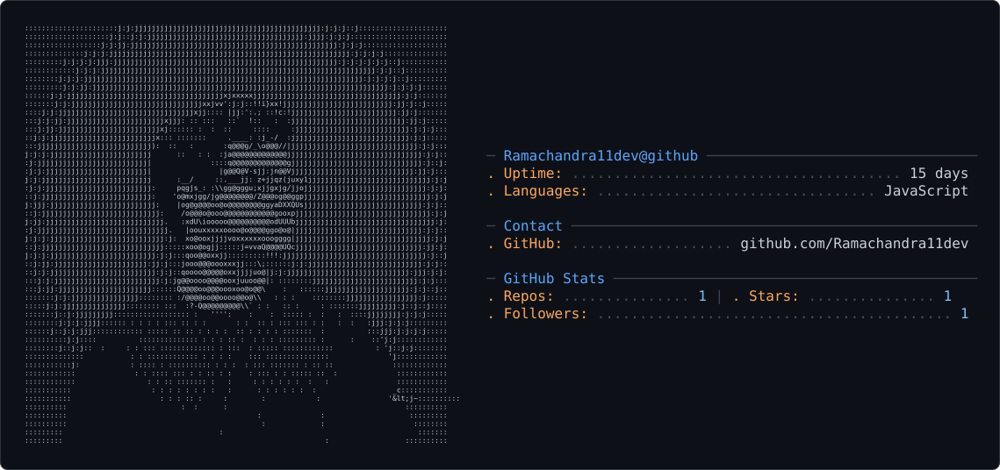

<picture>
  <source media="(prefers-color-scheme: dark)" srcset="dark_mode.svg" />
  <source media="(prefers-color-scheme: light)" srcset="light_mode.svg" />
  
</picture>

## Hi there 👋

  

  <em>🌍 <a href="https://ramachandra11dev.github.io/Ramachandra11dev/spinning_globe.html">Click here to view the Interactive Spinning Globe →</a></em>

---

- 🔭 I'm currently working on exciting projects
- 🌱 I'm currently learning new technologies
- 👯 I'm looking to collaborate on open source
- 💬 Ask me about anything
- 📫 How to reach me: ramachandra11vit@gmail.com
